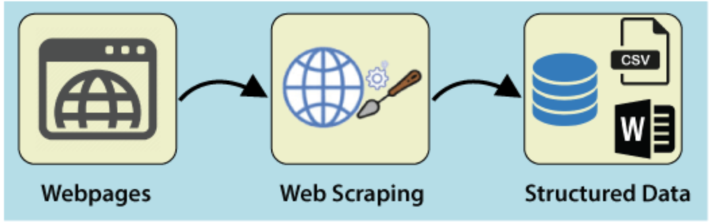
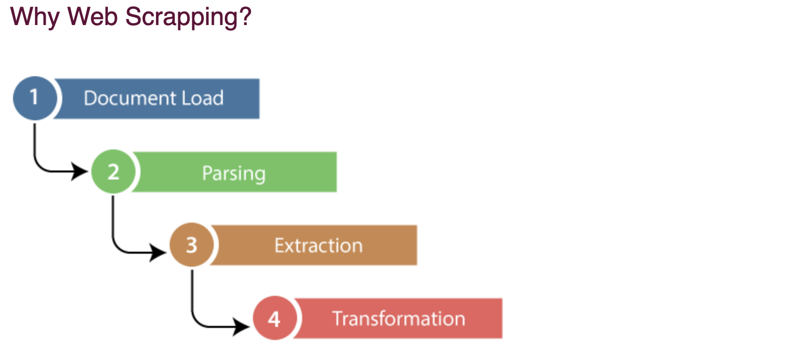

# WebScrapping

Web Scrapping extracts the data from websites in the unstructured format. It helps to collect these unstructured data and convert it in a structured form.

## Business Use Cases for Web Scrapping 
 1) Dynamic Price Monitoring

 2) Market Research

 3) Email Gathering     

 4) News and Content Monitoring

 5) Social Media Scrapping           
