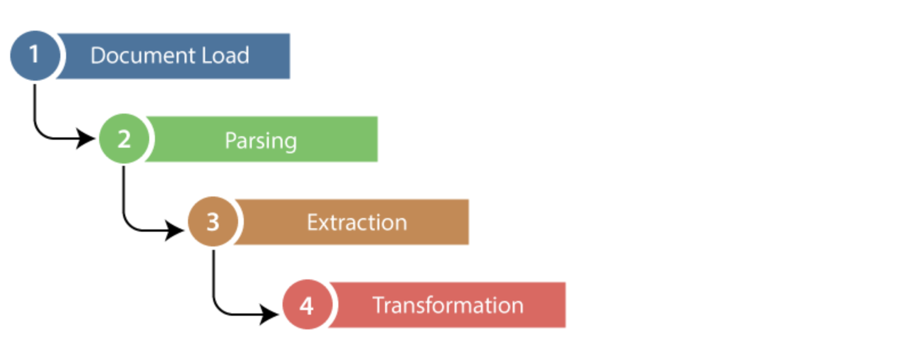
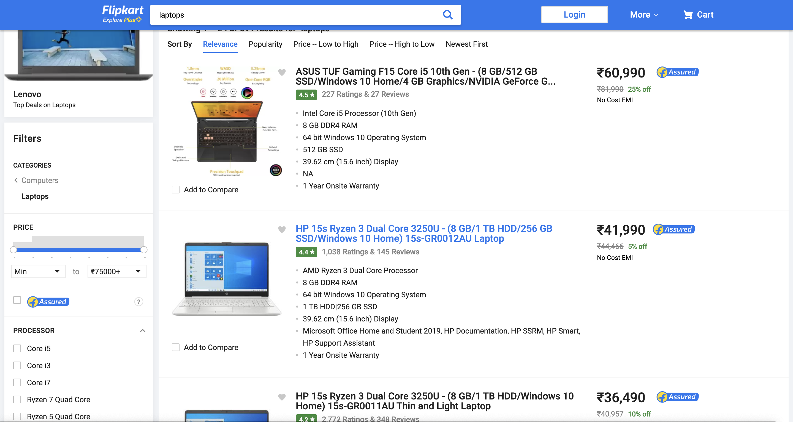
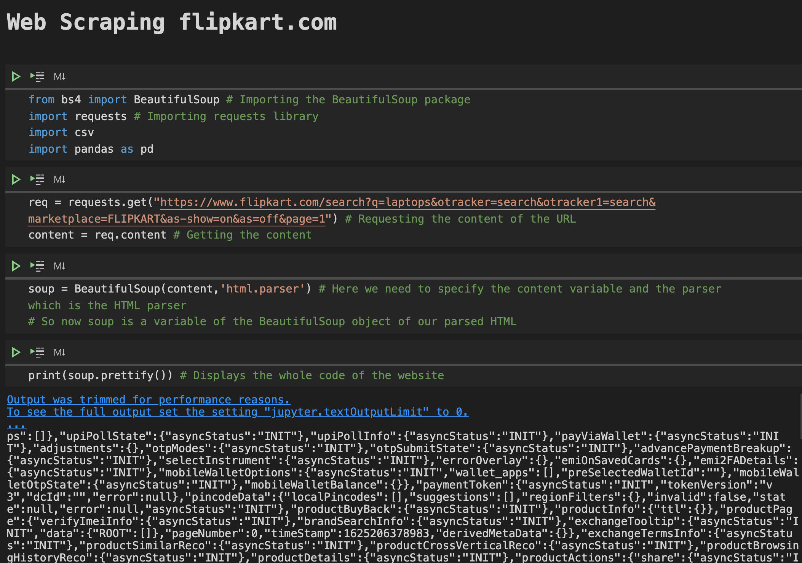
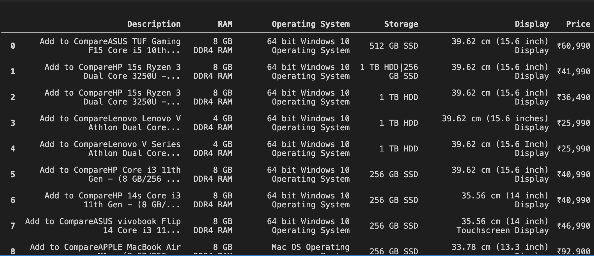

# WebScraping

Web data extraction, is the process of retrieving or “scraping” data from a website. This information is collected and then exported into a format that is more useful for the user and it can be a spreadsheet or an API.

### Data Extraction Pipeline

### Example: Web Scraping flipkart.com!
This is the Flipkart website comprising of different laptops. This page contains the details of 24 laptops. we try to extract the different features of the laptops such as the description of the laptop (model name along with the specification of the laptop), Processor (Intel/AMD, i3/i5/i7/Ryzen3Ryzen5/Ryzen7), RAM (4/8/16 GB), Operating System (Windows/Mac), Disk Drive Storage (SSD/HDD,256/512/1TB storage), Display (13.3/14/15.6 inches), Warranty(Onsite/Limited Hardware/International), Rating(4.1–5), Price (Rupees).

#### Using python inbuilt packages extracted raw data from site onto our servers 

#### Algo to convert the unstructured or raw string data into structured format. 

## Business Use Cases for Web Scrapping 

- Dynamic Price Monitoring
- Market Research
- Email Gathering     
- News and Content Monitoring
- Social Media Scrapping           
